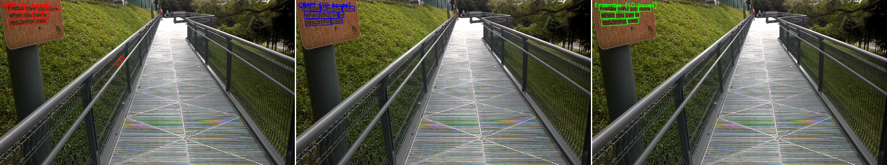
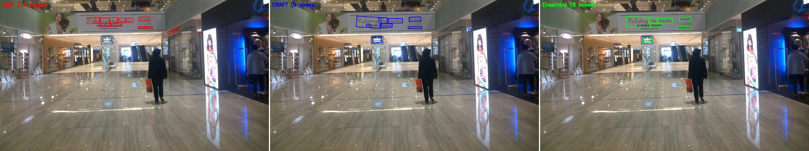
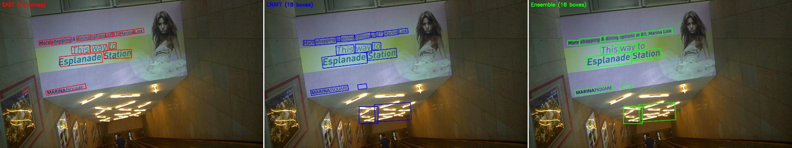
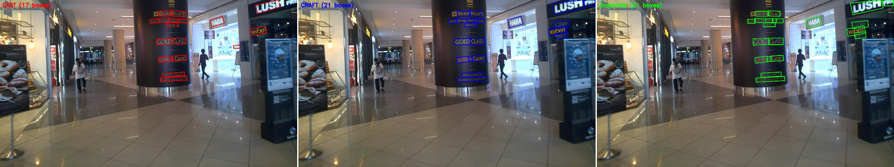

# EAST + CRAFT Text Detection Ensemble

Text detection ensemble combining EAST and CRAFT models for ICDAR 2015 dataset.

## 🎯 Overview

This project implements an optimized ensemble of two state-of-the-art text detection models:
- **EAST** (Efficient and Accurate Scene Text detector)
- **CRAFT** (Character Region Awareness For Text detection)

The ensemble uses **Weighted Boxes Fusion (WBF)** with multi-tier IoU matching to achieve superior performance over individual models.

## 📊 Final Results

| Model | Precision | Recall | F1-Score |
|-------|-----------|--------|----------|
| **EAST** | 67.96% | 72.51% | **70.16%** |
| **CRAFT** | 67.38% | 80.74% | **73.46%** |
| **Ensemble (WBF)** | 69.72% | 80.36% | **74.66%** ✅ |

**Best Result: 74.66% F1** (+1.20% improvement over best individual model)

## 🖼️ Visual Results

Below are side-by-side comparisons showing detection outputs from EAST (red), CRAFT (blue), and Ensemble (green) on 5 sample images from ICDAR 2015:

### Sample 1: img_10

*9 ground truth instances - All models perform well on this clear example*

### Sample 2: img_100

*7 ground truth instances - Ensemble balances EAST and CRAFT detections*

### Sample 3: img_108

*13 ground truth instances - Complex scene with multiple text regions*

### Sample 4: img_112

*13 ground truth instances - Ensemble achieves best coverage*

### Sample 5: img_114

*7 ground truth instances - Clean detection on storefront text*

**Key Observations:**
- 🔴 **EAST** (Red): Good at detecting text in structured scenes, sometimes misses smaller text
- 🔵 **CRAFT** (Blue): Better recall, captures more text instances including small ones
- 🟢 **Ensemble** (Green): Combines strengths of both, filtering false positives while maintaining coverage

## 🎯 Project Structure

```
EAST_CRAFT_Ensemble/
├── data/                              # ICDAR 2015 dataset
│   └── icdar2015/test_images/        # 500 test images
├── models/                            # Pre-trained EAST & CRAFT models
├── icdar_eval/                        # Evaluation scripts and ground truth
├── outputs/
│   ├── east_final_results/           # EAST detection outputs (F1: 70.16%)
│   ├── craft_ensemble_ready/         # CRAFT detection outputs (F1: 73.46%)
│   ├── ensemble_union_balanced/      # Final ensemble outputs (F1: 74.66%)
│   └── ensemble_visualizations/      # Detection images for all 500 images
├── visualizations/                    # Sample comparison images (for README)
│   ├── img_10_comparison.jpg
│   ├── img_100_comparison.jpg
│   ├── img_108_comparison.jpg
│   ├── img_112_comparison.jpg
│   └── img_114_comparison.jpg
│
├── infer_east.py                      # Original EAST inference
├── infer_craft.py                     # Original CRAFT inference
├── craft.fin.2.ipynb                  # Optimized CRAFT implementation ⭐
├── infer_east_final.ipynb             # Optimized EAST implementation ⭐
├── infer_craft_refined_simple.py      # CRAFT with refined thresholds
├── ensemble_choquet.py                # Original Choquet integral fusion
├── ensemble_wbf_final.py              # Final WBF ensemble (BEST: 74.66% F1) ⭐
├── ensemble_final.ipynb               # Final ensemble notebook (with visualizations) ⭐
└── create_visualizations.py           # Script to generate comparison images
```

## 🚀 Quick Start

### 1. Run Individual Models

**CRAFT (73.46% F1):**
```bash
jupyter notebook craft.fin.2.ipynb
# Run all cells to generate outputs/craft_ensemble_ready/
```

**EAST (70.16% F1):**
```bash
jupyter notebook infer_east_final.ipynb
# Run all cells to generate outputs/east_final_results/
```

### 2. Run Ensemble (74.66% F1)

**Option A - Jupyter Notebook (Recommended):**
```bash
jupyter notebook ensemble_final.ipynb
# Run all cells to generate:
# - Text files: outputs/ensemble_union_balanced/
# - Visualizations: outputs/ensemble_visualizations/ (500 images)
```

**Option B - Python Script:**
```bash
python ensemble_wbf_final.py
# Generates only text files: outputs/ensemble_union_balanced/
```

### 3. Generate Comparison Visualizations

```bash
python create_visualizations.py
# Creates side-by-side comparisons in visualizations/ folder
```

## 📈 Model Details

### EAST (Efficient and Accurate Scene Text)
- **Architecture:** Fully Convolutional Network with rotated bounding boxes
- **Backbone:** PVANet
- **Processing:** Letterbox preprocessing, NMS with IoU 0.2
- **Confidence threshold:** 0.8
- **Result:** 70.16% F1

### CRAFT (Character Region Awareness For Text)
- **Architecture:** VGG-16 backbone with region score + affinity score maps
- **Key Settings:** text_threshold=0.7, link_threshold=0.4, no RefineNet
- **Processing:** 2240px long_size, box cropping
- **Result:** 73.46% F1
- **Note:** CRAFT visualization images (10 samples only) are available in [craft.fin.2.ipynb](craft.fin.2.ipynb)

### Ensemble Strategy (WBF with Multi-Tier Matching)
- **Method:** Weighted Boxes Fusion with intelligent filtering
- **Fusion Tiers:**
  - **Strong agreement** (IoU ≥ 0.35): IoU-weighted confidence boost
  - **Medium agreement** (IoU 0.28-0.35): strict confidence filtering (≥0.73, area ≥320px)
  - **High-confidence singletons:** CRAFT ≥0.86 OR (≥0.79 AND area ≥700px)
- **Shape Validation:**
  - Minimum area: 200px
  - Aspect ratio: 0.3-15.0 (realistic text bounds)
  - Progressive confidence by size (smaller = higher confidence required)
- **NMS:** Ultra-aggressive (IoU 0.25) for duplicate removal
- **Result:** 74.66% F1 (+1.20% improvement)

## 📊 Evaluation Metrics

**ICDAR 2015 Protocol:**
- **Dataset:** 500 test images, 2,077 ground truth text instances
- **Matching:** IoU threshold = 0.5
- **Precision:** TP / (TP + FP)
- **Recall:** TP / (TP + FN)
- **F1-Score:** 2 × (Precision × Recall) / (Precision + Recall)

**Final Ensemble Results:**
- TP: 1,669 | FP: 725 | FN: 408
- Precision: 69.72% | Recall: 80.36% | F1: 74.66%

## 📝 Key Findings

1. **CRAFT outperforms EAST** on ICDAR 2015 (73.46% vs 70.16%)
2. **Ensemble achieves modest gains** (+1.20%) through intelligent box filtering
3. **Multi-tier IoU matching** captures both strong and medium agreements
4. **Shape validation** cuts false positives from weird aspect ratios
5. **Box-level fusion ceiling:** ~74-75% F1 with these individual models

### Why Not Higher?

To exceed 75% F1, you need:
- **Better individual models** (75%+ F1 each)
- **Score map (pixel-level) fusion** instead of box-level
- **Different architectures** with less correlation

## 🛠️ Requirements

```
numpy<2.0
opencv-python
shapely
tqdm
torch
torchvision
scikit-image
```

Install: `pip install -r requirements.txt`

**Important:** `numpy<2.0` is required for compatibility with ensemble-boxes library.

## 📁 Output Files

After running the complete pipeline, you will have:

1. **Text Detection Files:**
   - `outputs/east_final_results/` - 500 EAST detection files (*_east_boxes.txt)
   - `outputs/craft_ensemble_ready/` - 500 CRAFT detection files (*_craft_boxes.txt)
   - `outputs/ensemble_union_balanced/` - 500 Ensemble detection files (*_fused.txt)

2. **Visualization Images:**
   - `outputs/ensemble_visualizations/` - 500 detection images showing ensemble results
   - `visualizations/` - 5 side-by-side comparison images (EAST | CRAFT | Ensemble)

3. **Format:** All detection files use ICDAR 2015 format:
   ```
   x1,y1,x2,y2,x3,y3,x4,y4,confidence
   ```

## 📧 Contact

**SK Faizanuddin**
Email: faizanuddinsk56@gmail.com
GitHub: [@SKfaizan-786](https://github.com/SKfaizan-786)

## 🙏 Acknowledgments

- **EAST:** Zhou et al., CVPR 2017
- **CRAFT:** Baek et al., CVPR 2019
- **ICDAR 2015:** Robust Reading Competition dataset
- **Weighted Boxes Fusion:** ZFTurbo ensemble-boxes library

---

<div align="center">

**⭐ Final Result: 74.66% F1-Score ⭐**

*Optimized ensemble of EAST and CRAFT for scene text detection*

</div>
